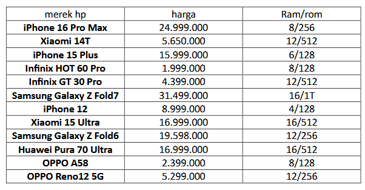

# week5-array

#### data array yang ingin saya pakai

#### 
#### map() -> ambil data hanya nama brand dan harga
.png)
.png)
####
#### filter() -> ambil data hp dengan harga < 10 juta
.png)
.png)
####
#### reduce() -> total semua harga hp
.png)
.png)
####
#### find() -> cari brand samsung pertama
.png)
.png)
####
#### some() -> apakah ada brand asus?
.png)
.png)
####
#### every() -> cek apakah semua hp harganya ada di atas 1 juta?
.png)
.png)
